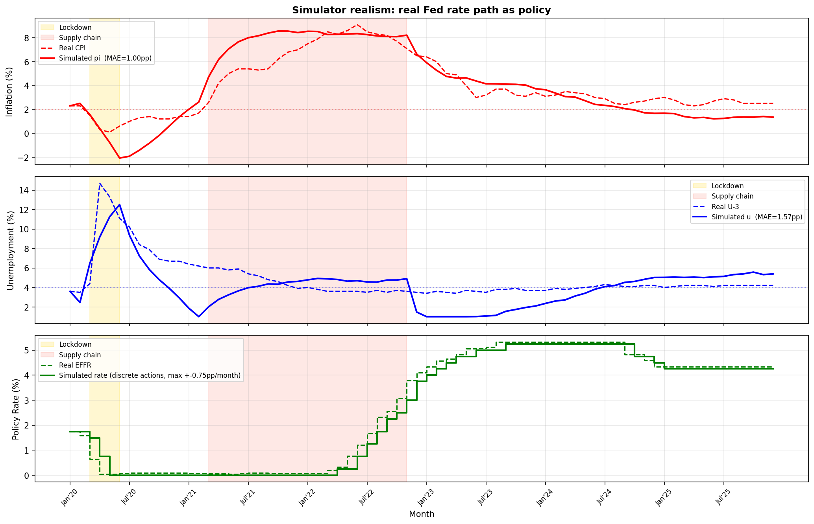
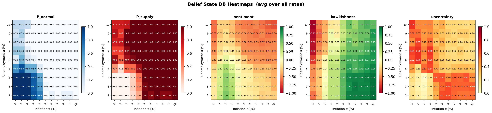
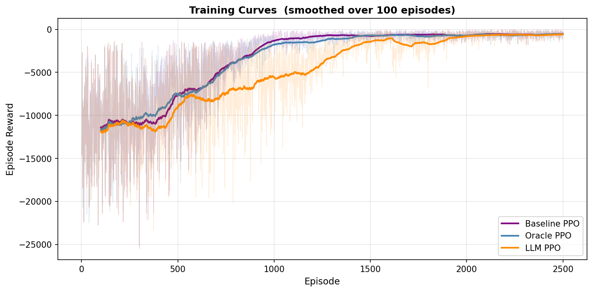
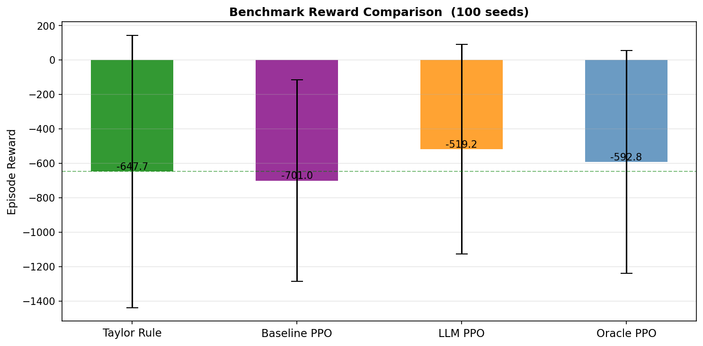
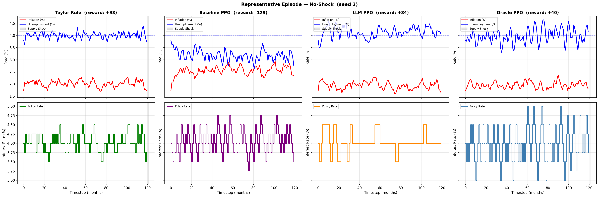
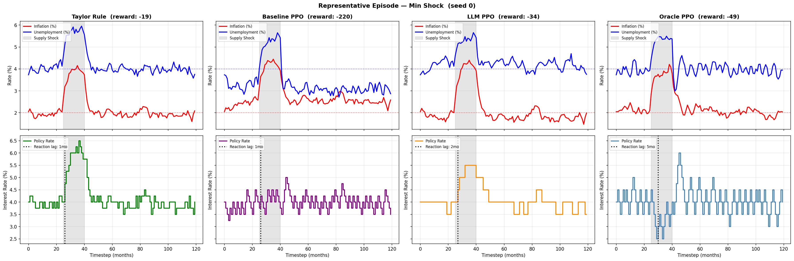
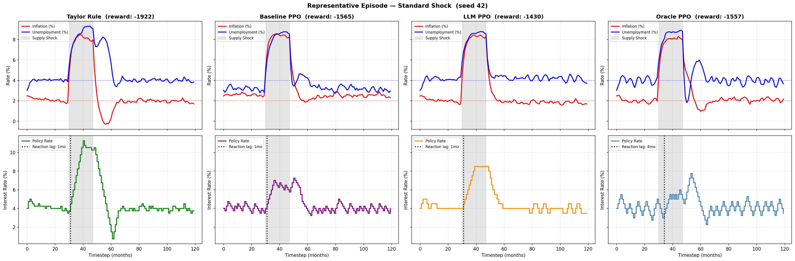
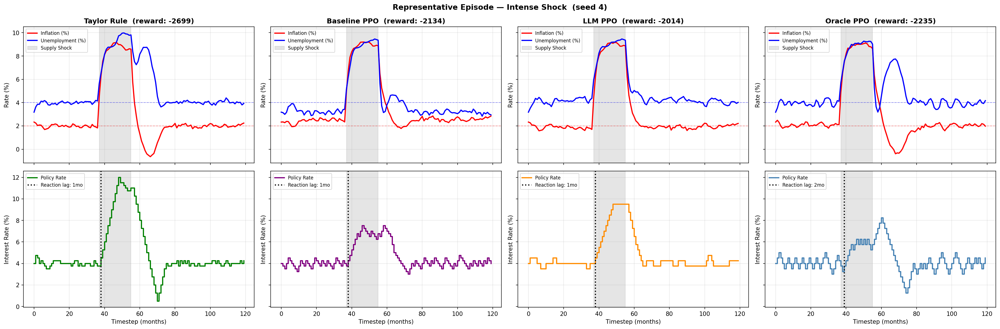
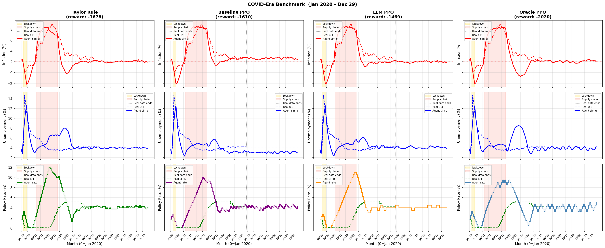

# Results

## Simulator Realism



## Belief State DB — Hierarchical Heatmap



---

## Paper Run

### Training Curves



### Benchmark Rewards



```
Benchmark — 100 evaluation seeds
--------------------------------------------------------
condition             mean      std   d_taylor
--------------------------------------------------------
taylor_rule        -647.66   790.60          —
baseline           -701.03   585.65     -53.36
llm                -519.19   608.75    +128.48
oracle             -592.81   647.30     +54.85
--------------------------------------------------------
```

### Benchmark Trajectories

| No Shock | Min Shock |
|---|---|
|  |  |

| Standard Shock | Intense Shock |
|---|---|
|  |  |

### COVID Evaluation



```
COVID Benchmark — 1 runs each
--------------------------------------------------------
condition             mean      std   d_taylor
--------------------------------------------------------
taylor_rule       -1678.37     0.00          —
baseline          -1610.02     0.00     +68.35
llm               -1469.07     0.00    +209.30
oracle            -2020.33     0.00    -341.96
--------------------------------------------------------
```
